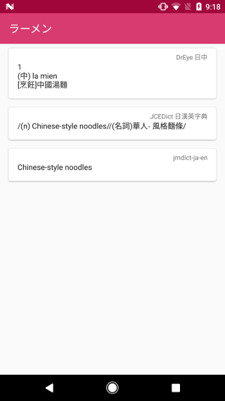

[](https://travis-ci.org/walkingice/MomoDict)

# Introduction

Still working in progress. A very simple dictionary app.




# Build

Clone this project and use gradle or Android Studio

```bash
$ cp githooks/pre-push .git/hooks/
$ ./gradlew build
```

However, before resolving [#2](../../issues/2), the dictionary file should be customized(use *.dict* instead of *.dict.dz*). Otherwise it cannot import dictionary correctly.

# License

Except the logo and brand name, other things are under the MIT License

